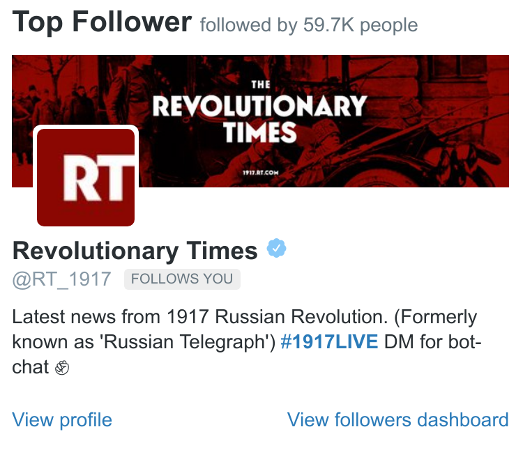

title: Berliner Schlagzeilen - Tweets von vor 100 Jahren
author:
	name: Falko Krause, Erik Koenen, Olivier Wagener
	github: shoutrlabs
	url: https://github.com/shoutrlabs/berliner-schlagzeilen
output: ./documentation/finals.presentation.html
theme: ./cleaver-select-theme
controls: true

--

# Berliner Schlagzeilen

## Tweets von vor 100 Jahren @VolksZeitung100

--
### Idee
"The newspapers are making morning after morning the rough draft of history."
The State (Columbia, South Carolina) December 5, 1905

Wir verbinden die Vergangenheit mit der Gegenwart und wollen die in Zeitungsseiten konservierte Geschichte dem breiten Publikum heute zugänglich machen.

Wir tweeten die Schlagzeilen der **Berliner Volkszeitung** und die Titelseite von vor 100 Jahren jeden Tag, auf den Tag.

--
### Daten: Berliner Volks-Zeitung digital (1917-1930)

Mit Anspruch, Sensationen und Unterhaltung für die Massen - die **Berliner Volkszeitung** war vor 100 Jahren die erfolgreichste Boulevardzeitung für die Metropole Berlin.

Datenquelle: digitalisierter historischer Zeitungsbestand der Staatsbibliothek zu Berlin – Preußischer Kulturbesitz 

Datenformate: ALTO-XML, METS-XML, JPEG, TIFF

Lizenz: CCO

--
### Coding: Twitter Bot
Wir tweeten die Schlagzeilen und ein Bild der Titelseite von vor 100 Jahren jeden Tag, auf den Tag.

&nbsp;

--
### Fake it till you ~~make~~ automate it
Wir tweeten seit dem letzten Abend des Hackatons.

&nbsp;

&nbsp;

Dann haben wir angefangen die Tweets automatisiert.

--
### Benchmarks: Followers
Wir hatten eigentlich gehofft **100 Follower** bis heute zubekomen.

Aber es ist noch zu spät!

--
### Benchmarks: Impressions and Mentions Oct '17

&nbsp;

&nbsp;

	

	

--

--

--

--
### Top Follower Oct '17

--
### Top Tweet Oct '17

--

--
### Links und Code
Ihr wollt uns helfen? Ich wollt auch tweeten?

# @volkszeitung100

https://twitter.com/Volkszeitung100

