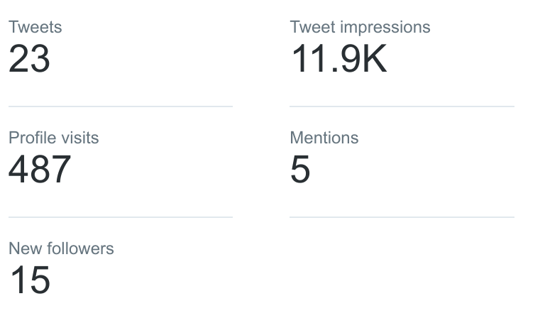

title: Berliner Schlagzeilen - Tweets von vor 100 Jahren
author:
	name: Falko Krause, Erik Koenen, Olivier Wagener
	github: shoutrlabs
	url: https://github.com/shoutrlabs/berliner-schlagzeilen
output: ./documentation/finals.presentation.html
theme: ./cleaver-select-theme
controls: true

--

# Berliner Schlagzeilen

## Tweets von vor 100 Jahren

--
### Idee
"The newspapers are making morning after morning the rough draft of history."
The State (Columbia, South Carolina) December 5, 1905

Wir verbinden die Vergangenheit mit der Gegenwart und wollen die in Zeitungsseiten konservierte Geschichte dem breiten Publikum heute zugänglich machen.

--
### Idee

Wir tweeten die Schlagzeilen der **Berliner Volkszeitung** und die Titelseite von vor 100 Jahren jeden Tag, auf den Tag.

Im Mittelpunkt der Schlagzeilen stehen derzeit:
- **Ersten Weltkrieg (1914-1918)**

- **Revolution in Russland 1917**

--
### Daten: Berliner Volks-Zeitung digital
Mit Anspruch, Sensationen und Unterhaltung für die Massen - die **Berliner Volkszeitung** war vor 100 Jahren die erfolgreichste Boulevardzeitung für die Metropole Berlin.

--
### Daten: Berliner Volks-Zeitung digital

Datenquelle 
**digitalisierter historischer Zeitungsbestand der Staatsbibliothek zu Berlin – Preußischer Kulturbesitz** 
Datenformate 
**ALTO-XML**, **METS-XML**, **JPEG**, **TIFF** 
Lizenz 
**CCO**

--
### Coding: Twitter Bot
Wir tweeten seit Beginn des Hackathons konstant im Erscheinungsrhythmus der Zeitung **morgens und abends** die neuen Schlagzeilen.

Erst händisch, dann …

--
### Fake it till you ~~make~~ automate it
...und dann haben wir das Tweeten immer weiter automatisiert und werden dies weiter vorantreiben.

&nbsp;

&nbsp;

--

&nbsp;

&nbsp;

--
### Besucherstatistiken Oct '17

--
### Top Tweet Oct '17

--
### Besucherstatistiken Nov '17

&nbsp;

&nbsp;

	

		
	

	

		
	

--
### Followers Nov '17
Wir hatten eigentlich gehofft **100 Follower** bis heute zubekomen.

Aber es ist noch zu spät!

--
### Links und Code
Ihr wollt uns helfen? Ihr wollt auch mit bots tweeten?

# @volkszeitung100

https://twitter.com/Volkszeitung100

