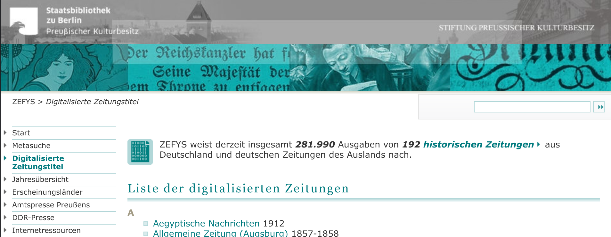
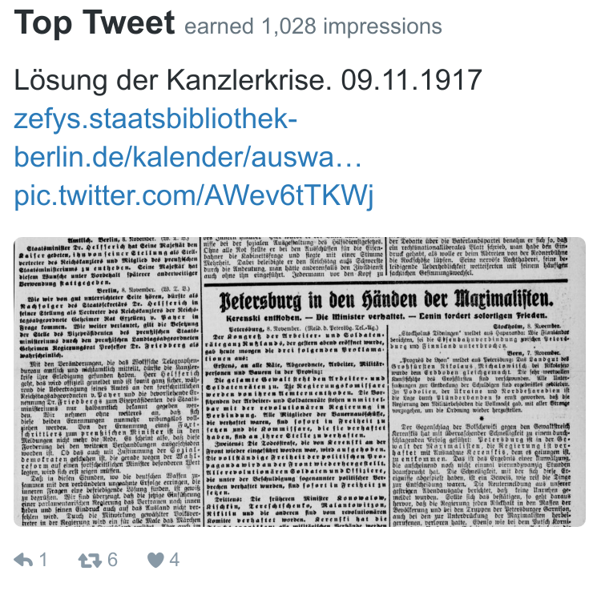
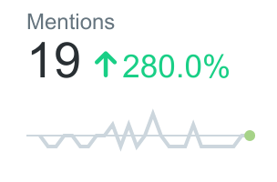

title: Berliner Schlagzeilen - Tweets von vor 100 Jahren
author:
	name: Falko Krause, Erik Koenen, Olivier Wagener
	github: shoutrlabs
	url: https://github.com/shoutrlabs/berliner-schlagzeilen
output: ./documentation/followup.condingdavinci.2018-01.html
theme: ./cleaver-select-theme
controls: true

--

# Berliner Schlagzeilen

## Tweets von vor 100 Jahren
<style>
.fullscreen {
	position: fixed;
    top: 5%;
    left: 5%;
    height: 90%;
    width: 90%;
    background-size: ;
    background-size: contain;
    background-repeat: no-repeat;
    background-position: center;
}
.fullscreen-full {
	position: fixed;
    top: 0;
    left: 0;
    height: 100%;
    width: 100%;
    background-size: ;
    background-size: contain;
    background-repeat: no-repeat;
    background-position: center;
}
</style>
--
### Team
<div class="left">
	<div>&nbsp;</div>
	Falko <br><span class="smalldec">fk@shoutrlabs.com</span><br><br>
	Erik <br><span class="smalldec">ekoenen@uni-bremen.de</span><br><br>
	Olivier <br><span class="smalldec">ow@shoutrlabs.com</span>
</div>
<div class="right">
	
</div>

--
<div style="background-image: url('img/team.volkszeitung100.jpg'); " class="fullscreen-full" ></div>

--
### Idee
"The newspapers are making morning after morning the rough draft of history."
The State (Columbia, South Carolina) December 5, 1905

Wir verbinden die Vergangenheit mit der Gegenwart und wollen die in Zeitungsseiten konservierte Geschichte dem breiten Publikum heute zugänglich machen.

--
### Idee
<style>
	ul {
		padding: 0px 0 0 27px;
	}
</style>
Wir tweeten die Schlagzeilen der **Berliner Volkszeitung** und die Titelseite von vor 100 Jahren jeden Tag, auf den Tag.

Im Mittelpunkt der Schlagzeilen stehen derzeit:
- **Erster Weltkrieg (1914-1918)**

- **Revolution in Russland 1917**

--
### Daten: Berliner Volks-Zeitung digital
Mit Anspruch, Sensationen und Unterhaltung für die Massen - die **Berliner Volkszeitung** war vor 100 Jahren die erfolgreichste Boulevardzeitung für die Metropole Berlin.


--
### Daten: Berliner Volks-Zeitung digital
<style>
	.smalldec {
		font-size: 0.7em;
		color: #7a7a7a;
		margin-top: 0;
	}
</style>

<span class="smalldec">Datenquelle</span><br>
**digitalisierter historischer Zeitungsbestand der Staatsbibliothek zu Berlin – Preußischer Kulturbesitz**<br>
<span class="smalldec">Datenformate</span><br>
**ALTO-XML**, **METS-XML**, **JPEG**, **TIFF**<br>
<span class="smalldec">Lizenz</span><br>
**CCO**



--
### Coding: Twitter Bot
Wir tweeten seit Beginn des Hackathons konstant im Erscheinungsrhythmus der Zeitung **morgens und abends** die neuen Schlagzeilen.

Erst händisch …


--
### Fake it till you ~~make~~ automate it
 … und dann haben wir das Tweeten immer weiter **automatisiert** …

<div>&nbsp;</div>

<div>&nbsp;</div>

… doch wir sind noch nicht fertig.

--
<div>&nbsp;</div>

<div>&nbsp;</div>


--
### Besucherstatistiken Oct '17


--
### Top Tweet Nov '17


--
### Besucherstatistiken Nov '17
<div>&nbsp;</div>
<div>&nbsp;</div>
<div style="background: white; width: 100%; height: 254px;">
	<div class="left">
		
	</div>
	<div class="right">
		
	</div>
</div>

--
### Followers Nov '17
Wir hatten eigentlich gehofft **100 Follower** bis heute zu bekommen.

Aber es ist noch nicht zu spät!


--
<div style="background-image: url('img/presentation.volkszeitung100.jpg'); " class="fullscreen-full" ></div>

--
### 100 Followers Nov '17

Dank der Coding da Vinci Abschlussveranstaltung hatten wir unser Ziel am Dienstag nach der Veranstaltung erreicht!

--
<div style="background-image: url('img/papergirl.volkszeitung100.jpg'); " class="fullscreen-full" ></div>

--
### Nach Coding da Vinci ist vor dem Coden
Wir arbeiten weiter an unserm **Twitter feed**.

Jetzt wollen wir aber auch noch **wissenschaftliche Erkentnisse** bekommen!

--
### Meta Data Statistic: Script
We have a powerful script that can parse and analyze local and remote data.
```js
function xml2obj(fileName) { … }
function parseMETS(fileName) { … }
function recursionReducer(recurseFkt, root, addSelf) { … }
function recurseToString(root) { … }
function recurseToLine(root) { … }
function recurseToBlock(root) { … }
function zeroPad(num, size) { … }
function getSize(o) { … }
function px2mm(l) { … }
function parseAlto(fileName) { … }
function getZipContent(zipFilePath) { … }
function parseZipContent(file) { … }
```

--
### Meta Data Statistic: Results - Page 1/2

```json
{
	"Strings": 3345,
	"TextLines": 377,
	"arithmeticMeanStrinsPerLine": "8.8727",
	"arithmeticMeanLineLengthInMm": "84.0",
	"blocks": 16,
	"arithmeticMeanLinesPerBlock": "23.5625",
	"arithmeticMeanWC": "0.51236",
	"sizeInPx": {
		"xMin": 170,
		"xMax": 3407,
		"yMin": 507,
		"yMax": 5465
	},
	"sizeInMm": {
		"width": "274.1",
		"height": "419.8"
	},
	"fileName": "alto/F_SBB_00009_18900401_038_077_2_001.xml"
},
```

--
### Meta Data Statistic: Results - Page 2/2

```json
{

	"top10words": [
		"Berlin",
		"Forckenbeck",
		"Zahl",
		"Leiche",
		"Tochter"
		…
	],
}

```

--
### Machine Learning - better OCR data

Our Ideas:
- Fix the faulty ORC texts.
- Train NN for ORC for old german fonts.

Clemens and his team at SPK are already working on that :D

We will make more plans over a beer on how to collaborate.

--
### Links und Code
Ihr wollt uns helfen? Ihr wollt auch mit Bots tweeten?


# @volkszeitung100
<div style="text-align: center;">
	https://twitter.com/Volkszeitung100
</div>
